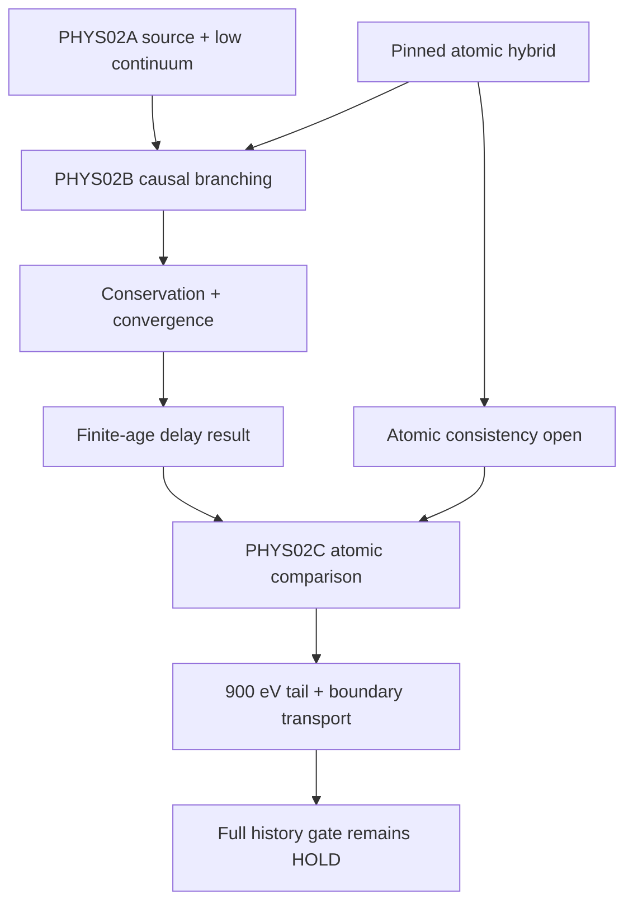

# HYPOTHESIS_GRAPH — CR-PHYS02B

## Nodes and present status

| Node | Physical question / competing hypothesis | Status and discriminating evidence |
|---|---|---|
| H1 | A terminal yield alone determines finite-age heating | REJECTED as a clock-reconstruction route by the parent's time-rescaling argument. The table remains valid for its declared terminal purpose. |
| H2 | Direct0.1–10eV source admits causal fixed-bath stopping | Parent scoped result retained. New discretization approaches its analytic continuum: heat-power difference0.06934%, cumulative heat0.07699%. |
| H3 | High-energy birth can be included as repeated causal branching with closed ledgers | PROMOTE_SCOPED within the explicit0.1–900eV hybrid operator. Two ionization daughters, one excitation daughter, prescribed-bath drift and disjoint reservoirs obey the energy/count identities. Independent admission is recorded in review/FINAL_DECISION.json. |
| H4 | Same-operator terminal proxy is adequate at316.88yr | REJECTED for this source/bath/truncation: causal heat power is3.41089% of that proxy; active storage98.2951%. This is not a universal lag factor. |
| H5 | Numerical closure establishes atomic physical accuracy | REJECTED. He total/sharing Q inconsistency, effective CCC energy costs and missing external CGI comparison persist. atomic_G02 remains UNRESOLVED. |
| H6 | Current result permits a full production CR/IGM history | HOLD. Unselected900eV+ source, photon/thermal boundary, source histories, species/atomic coverage and full proton loss remain open. |
| H7 | A coherent atomic representation can make the next comparison physically interpretable | NEXT_ACTION: CR-PHYS02C-ATOMIC-CONSISTENCY. Same-source comparison must quantify changes without absorbing differences into numerical tolerances. |

## Dependency graph

## Falsification and scope discipline

For H3, a failure of either daughter counting, physical source/rate units, positivity,
disjoint ledgers, continuum limit or predeclared observable refinement blocks admission.
R001 supplied an actual numerical falsifier of coarse-grid adequacy. R002 repaired
that discretization failure without changing the physical candidate or threshold.

For H5, the directly observed Q and excitation-energy differences are counterevidence;
hashes, tiny conservation residuals and matching numerical solvers cannot negate it.
For H7, a future failure to identify coherent data is a source blocker, not permission
to fabricate atomic coefficients or count a formula consistency check as experiment.

The original goal—time-dependent charged-particle energy deposition—is preserved.
No detached formalism or unrelated parameter branch replaces it. The separate
R17B2B photon route and xi=0.1 knot branch were not adopted by this xi=0.01 unit.
