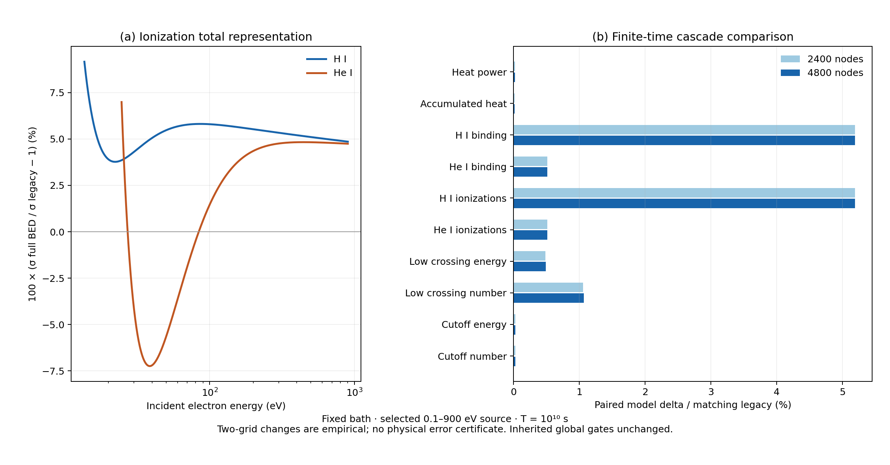

# CR-PHYS02C-ATOMIC-CONSISTENCY

## 현재 결론

**같은 진동자 세기에서 이온화 총률과 두 딸전자 분포를 구성하는 full BED 조건부 모형을 구현하고, PHYS02B와 같은 두 격자에서 실제 수송 비교를 마쳤다.** 선택한 H analytic oscillator와 He Kim2000 계수에 대해 분포 적분과 총률이 일치한다. 최종4800 node에서 이전 모형보다 누적 H 이온화가5.19218%, He 이온화가0.516080% 증가하지만 열률 증가는0.0258541%다. 원자 표현의 변화가 이 유한시간 문제의 즉시 가열에 동일한 비율로 전달되지는 않았다.

수치 R001은 actual exit0,15/15 PASS_SCOPED다. **독립 최종 과학 판정과 그 적용 범위는 [FINAL_DECISION.json](review/FINAL_DECISION.json)에 기록한다.** 이 문서의 수치 통과를 production 승인으로 해석하지 않는다. PHYS02_DELAY OPEN, production_history HOLD, atomic_G02 UNRESOLVED, b_grid NO_GO, all_bound OPEN, R17B2B NO_CERTIFIED_SOURCE_SHARPENING을 유지한다.

## 1. 왜 이 비교를 했는가

PHYS02B는 NIST BEQ 총률과 정규화한 BED 에너지 분포를 결합했다. NIST 공식 introduction은 이런 정규화를 설명하므로 이전 모형을 대수적으로 잘못됐다고 판정하지 않는다. 다만 사용한 He Q=0.8841과 인쇄된 oscillator 계수의 모멘트가 같지 않았고, rounded H 다항식은 무한구간에서 양성을 유지하지 않는다. 따라서 기존 수치와의 일관성 주장에 필요한 원자 표현을 더 명확히 해야 했다.

이번에는 전 구간에서 양인 수소 Coulomb oscillator와 Kim–Johnson–Rudd2000 원 논문의 He 계수를 직접 사용한다. 같은 g(w)=df/dw에서 Ni, K와 유한상한 D(t)를 구하고, full BED 분포를 적분해 총률을 얻는다. 계수는 수송 결과를 보기 전에 고정했다. 자세한 식·유도·양성 및 사건 보존 증명은 [DERIVATION_KO.md](DERIVATION_KO.md), 실제 원문 조사는 [원자 소스 감사](research/ionization_sources/ATOMIC_PRIMARY_SOURCE_AUDIT_KO.md)에 있다.

| 입력 | H | HeI |
|---|---:|---:|
| B [eV] |13.6057|24.587|
| U [eV] |13.6057|39.51|
| N |1|2|
| Ni=∫g dw |0.4349958493251480|1.61008048|
| Qdf=(2/N)∫g/(1+w)dw |0.5668244319103390|0.9130407333333333|
| K=2−Ni/N |1.5650041506748520|1.19495976|

Qdf는 모멘트 진단용이다. BEQ 총률의 Q만 교체하는 것은 full BED와 다르므로 하지 않았다. Kim2000 식의 곱셈 모양 문자에 대해서는 NIST의 가산식 및 같은 논문의 적분 total과 일치하는 가산 형태를 명시적으로 사용했다. 출판 erratum을 찾았다고 주장하지 않는다. H oscillator의 정확성은 비상대론적 Coulomb 원자에 한정하며 BED 전자충돌 전체의 정확성 인증이 아니다.

## 2. 고정한 물리와 바꾼 부분

부모 science는 `929abd7ff981f08ed965e302532af9daac06316f`, 운영 head는 `b5b0f2244311a6e46692da55e75db6d04d3ef305`다. 현재 작업은 그 위의 별도 `research/cr-phys02c-atomic-consistency-20261011` 단위다. 다른 branch의 NIST1000–3000 eV 표·여기 kernel·다른 하류 convolution은 수치 입력으로 가져오지 않았다.

| 항목 | 이번 비교의 정의 |
|---|---|
| 원천 | 활성1–4 MeV 양성자가 생성한 직접 전자 중0.1–900 eV; Qe(W,t)=t A(W) |
| 출생 표지 | 직접0.1–10 eV, 직접10–900 eV 두 성분 |
| 시간 | 빈 초기조건에서 T=10¹⁰ s≈316.88 yr |
| bath | nH=140 m⁻³, YHe=.248, xHII=xHeII=.01, Tgas=100 K 고정 |
| 여기 | 같은 CCC27 raw table, native first-zero effective cost, 선형보간, 외삽 없음 |
| 감속·수송 | 부모 Coulomb closure, 양의 에너지·수 보존 투영, source quadrature, sparse exponential 그대로 |
| 바꾼 부분 | HI/HeI ionization 객체의 총률과 SDCS만 같은 full BED 표현으로 교체 |
| 사건 | 느린 W를0..(E−B)/2에서 한 번 뽑고 W와 E−B−W 두 전자 생성, binding B 별도 기록 |

분포의 projection-knot별 수치 적분을 정규화하는 기존 처리는 유지했다. 새 모형의 물리적 총률과 그 분포 적분이 같기 때문에 이 보정은 수치 오차만 보정한다.4800 node에서 보정계수와1의 최대 차이는9.568×10⁻¹³였다. 이전 BEQ/BED의 서로 다른 물리 표현 사이 정규화와 구별한다.

## 3. 실제 유한시간 결과

다음은 모두 새4800 node의 selected-total 결과다. 에너지 분율의 분모는 선택 원천이 T까지 주입한9.0063128921×10⁻³³ J m⁻³다.

| 저장 또는 흡수 채널 | T에서의 에너지 [J m⁻³] | 선택 주입 에너지의 비율 |
|---|---:|---:|
| 활성 전자의 운동에너지 |8.852069774×10⁻³³|98.2873889%|
| 누적 Coulomb 열 |1.191831528×10⁻³⁴|1.32332903%|
| H 이온화 결합에너지 |1.347478899×10⁻³⁵|0.149614933%|
| He 이온화 결합에너지 |9.134028787×10⁻³⁷|0.0101418071%|
| H 여기 reservoir |1.729088930×10⁻³⁵|0.191986327%|
| He 여기 reservoir |4.366233941×10⁻³⁷|0.0048479705%|
|0.1 eV cutoff 잔류 운동에너지 |2.944261137×10⁻³⁶|0.0326910820%|

합은 주입 에너지와 부동소수점 오차 내에서 같다. low-cross counter는 내부 경계를 통과한 누적량이므로 위의 분리된 에너지 분할에 더하지 않는다. excitation reservoir는 광자 수·스펙트럼·재흡수를 풀었다는 뜻이 아니다.

| 관측량 | 새4800 node 값 | 이전 같은 격자 대비 변화 |
|---|---:|---:|
| 누적 H 이온화 횟수 밀도 |6.181454666×10⁻¹⁸ m⁻³|+5.19218398%|
| 누적 He 이온화 횟수 밀도 |2.318710032×10⁻¹⁹ m⁻³|+0.516080131%|
| 열률 |3.441885017×10⁻⁴⁴ J m⁻³ s⁻¹|+0.025854058%|
| 누적 열 |1.191831528×10⁻³⁴ J m⁻³|+0.019387464%|
|10 eV 하향 경계 통과 누적 에너지 |3.347449077×10⁻³⁵ J m⁻³|+0.492946064%|
|10 eV 하향 경계 통과 누적 전자 수 |2.550912406×10⁻¹⁷ m⁻³|+1.06814459%|
| 활성 전자 운동에너지 |8.852069774×10⁻³³ J m⁻³|−0.007831185%|
| 같은 연산자의 terminal-yield 열률 비교값 |1.007056687×10⁻⁴² J m⁻³ s⁻¹|−0.175374101%|

새 모형에서도 대부분의 주입 에너지가 T에서 활성 전자의 운동에너지로 남는다. 실제 유한시간 열률은 같은 고정 연산자의 terminal yield를 즉시 적용한 비교값의 **3.41776691%**다. 이 terminal 값은 같은 연산자의 수학적 resolvent이며 원천의 유효 시간 범위 밖을 실제로 진화시킨 결과가 아니다. 그러므로 에너지가 결국 어디로 갈 수 있는지와 지금 얼마가 가열되는지를 계속 구별해야 한다.

이온화 모형 변화는 모두 이온화 문턱 위에서 작용한다. 처음부터10 eV 이하에서 태어난 성분은 단방향 에너지 수송에서 이온화 모형을 방문하지 않으므로 물리적으로 같다. 그 성분의 매우 작은 계산 차이는 roundoff로 분류한다. 이 결과만으로 H 또는 He 실험 단면적의 오차, 두 종 중 한 원인만의 독립 민감도, 전체 재이온화 이력의 변화량을 추정하지 않는다.

### 출생 에너지와 실제 가열 위치를 구분한 진단

저장된4800 node 상태에서 P=scale·e·Σ[b(Ej)/Ej] zj를 직접 합해 Coulomb 열률을 재구성했다. 이 후처리는 새 G나 수송을 만들지 않았고, 네 가지 종단 heat ledger 비교의 최대 상대 잔차가2.31×10⁻¹⁴였다.

| T에서의 가열 성분 | 새 full BED | 이전 모형 |
|---|---:|---:|
| 직접0.1–10 eV 출생 성분의 전체 열률 [J m⁻³ s⁻¹] |2.413635954×10⁻⁴⁴|2.413635954×10⁻⁴⁴|
| 직접10–900 eV 출생 성분의 전체 열률 [J m⁻³ s⁻¹] |1.028249063×10⁻⁴⁴|1.027359426×10⁻⁴⁴|
| 직접10–900 eV 출생 성분이 실제 E≤10 eV에서 낸 열률 [J m⁻³ s⁻¹] |5.766013515×10⁻⁴⁶|5.687740016×10⁻⁴⁶|
| 고에너지 출생의 전체 열률/직접 저에너지 출생 열률 |42.6016633%|42.5648045%|
| 고에너지 출생의 E≤10 eV 열률/직접 저에너지 출생 열률 |2.38893256%|2.35650285%|

따라서 고에너지 출생을 포함해 생긴42.60%의 전체 열률 추가량을 저에너지 영역에 유입되어 가열된 양으로 읽으면 안 된다. 실제 E≤10 eV에서의 추가량은 이 진단에서2.38893%다. 해당 low-mask 열률은 이전 모형보다1.37618% 크지만 이 후처리는4800 node의 값이며 별도의 matched low-mask 격자 수렴 인증을 수행하지 않았다.

왼쪽은 같은 입사 에너지에서 full BED/legacy 총률의 차이이며 He의 차이는 에너지에 따라 부호가 바뀐다. 오른쪽은 같은 격자끼리 짝지은 유한시간 관측량 차이다. 그림의 두 격자 막대와 총률 곡선은 오차막대가 아니다. 정확한 수치는 `REPORT_TABLES.json`과 `evidence/diagnostics/PLOT_DATA.json`에 있다.

## 4. 수치적으로 무엇을 확인했는가

독립 소스 계산은 별도 스크립트에서50자리 적분을 수행했다. H의 w 적분과 y=1/(1+w) 변환 적분이 일치했고, continuum sum은 문헌의 인쇄값과 맞았다. 구현의 FP64 Gauss128 D(t)는 독립50자리 값과 최대2.405×10⁻¹³의 상대차를 보였다. He의 닫힌 D(t)와 적응 적분은 최대6.79×10⁻¹⁶이었다. 총률과 느린 반구간 SDCS의 적응 적분 비교는 임계값1+10⁻⁸ 부근을 포함해 최대4.532×10⁻⁹로 고정 허용값2×10⁻⁸을 만족했다.

새 수송은(800,1600)과(1600,3200) 셀, 각각2400·4800 node에서 종단 상태만 계산했다. 저장된 이전 R002의 두 격자 결과와 짝지었으며 이전 legacy 수송 또는 부모 과학 suite를 다시 실행하지 않았다.

| 검사 | 관측 결과 | 고정 기준 |
|---|---:|---:|
|4800 연산자 에너지·전자 수 상대 잔차 최대 |5.721×10⁻¹⁶|5×10⁻¹²|
| 종단 전파 ledger 상대 잔차 최대 |6.006×10⁻¹⁵|10⁻⁹|
| 같은 연산자 terminal ledger 상대 잔차 |9.277×10⁻¹⁵|10⁻⁹|
| 최소 상태 성분 |0|≥−10⁻¹²|
| sharing 적분 상대차 최대 |1.614×10⁻¹³|2×10⁻⁸|
| 채널 격자 변화 최대: low-cross 에너지 |1.38643%|2%|
| low-cross 전자 수 격자 변화 |1.14123%|3%|
| 열률 격자 변화 |0.0489060%|2%|

열률 자체의 격자 변화0.0489060%는 두 모형의 차이0.0258541%보다 크다. 따라서 단순히 마지막 격자 값만 빼서 물리 변화가 분리되었다고 판정하지 않았다. 같은 격자에서 두 모형의 차이 Δ를 먼저 계산한 뒤 그 차이가 격자 배증에서 얼마나 바뀌는지 확인했다. 열률의 r=|Δ4800−Δ2400|/|Δ4800|는0.0007069였다. 검토한17개 parent output-vector 행은 모두 사전 기준 r<1/3 및 부호 일치를 만족했다. 이는 두 격자에서의 경험적 분리이며 오차 상계 또는 통계 검정이 아니다. 대부분의 공통 discretization 효과가 차감되지만 아직 공유된 체계 오차의 상계를 주지는 않는다.

95개 전체 행 가운데66개가 이 경험적 기준을 만족하고,22개는 두 격자에서 정확히0인 차이,7개는 미분리였다. 미분리 행은 변하지 않아야 하는 직접 저에너지 출생 성분의 부동소수점 수준 차이로, 새 물리 효과로 보고하지 않는다.

실제 수송 두 번의 wall time은151.427 s, peak RSS는1,390,000 KiB였다. 실행 전에 실제8 GiB cgroup 제한과 현재 사용량을 확인하고1 GiB reserve를 적용했으며, BLAS·MKL·OMP·NumExpr를 모두1 thread로 고정했다. NCP64CPU128GB를 이 실행의 실제 환경으로 쓰지 않았다.

## 5. 원자 출처와 남은 문턱 문제

NIST Q=.8841의 정확한 oscillator 버전 계보 및 현재 CGI와의 수치 동등성은 미확인이다. 이번 원문의 full BED는 소스 정의가 더 명확한 별도의 조건부 표현이다. 실험 오차 인증이나 NIST 서비스의 현재 구현 재현은 아니다.

CCC27의 에너지 비용과 단면적은 이번 수치 비교에서 원래대로 유지했다. native first-zero marker를 분광학적 실제 전이에너지로 동일시하지 않는다. 전이 비용만 교체하는 것, 입사 에너지 축을 이동하는 것, excess-energy에 맞춰 표를 이동하는 것은 각각 다른 모형 선택이다. 이번 복구에서 읽은 부모 README는 LS coupling 및 계산 채널을 설명하지만27개 native 비용의 표적 Hamiltonian 에너지 동일성을 주지 않는다. 보조 source lookup은 환경 중단으로 새로운 원문 증거를 확보하지 못했으므로 SOURCE_IDENTITY_UNRESOLVED로 닫았다. 이를 최신 CCC 자료의 완전한 검색 또는 부재 증명으로 읽지 않는다. H 비용의 Rydberg식 수치 일치는 추론에 그치며 He 비용의 원인은 확인되지 않았다.

HeII 채널, n≥5 등의 완전성, 중성 recoil·thermal diffusion, cutoff 이후 열화, photon branching·수송·재흡수, bath feedback, 원천 시간 근사 및 전체 이력은 닫지 않았다.

## 6. NCP의 다음 유한 작업과 전달

독립 최종 판정이 이 조건부 단위를 통과시키면 다음 수치 노드는 **CR-PHYS02C-NCP-MATCHED-THIRD-GRID**다. 두 모형을 각각(3200,6400), 총9600 node에서 순차적으로 계산하고 저장된4800 결과와 짝지어 차이의 안정성을 한 번 더 확인한다. source·bath·CCC·Coulomb·수치 허용값은 그대로다. 최대 수송2회, wall3600 s로 제한하며 기존 과학 suite를 반복하지 않는다.

현재 NCP 실행은 **PREPARED_NOT_EXECUTED**다. 실행기는 실제 CPU affinity/quota, RAM, disk, 현재 동시 사용을 확인한다. 최소12 GiB working availability와8 GiB 추정 peak 및12.5%(최소1 GiB) reserve를 적용한다.64개의 rank를 자동 배치하지 않는다. 계약 SHA·전체 입력 manifest·독립 review SHA·READY DAG가 맞아야 실행을 허용한다. 실패·timeout도 실제 종료코드와 로그를 보존하고 결과 ZIP으로 수집한다.

추가 첨부 없이 시작하도록 NCP prompt, 계약, 모든 필요한 부모 코드·CCC raw 입력·저장된 비교 결과, 환경 명세, resource probe와 수집기를 완결 handoff ZIP에 포함한다. 별도 시작 문서에는 게시 후의 정확한 Git pin·Drive/Dropbox locator·ZIP hash를 제공한다.

## 7. 검토와 재현 경계

구현자는 최종 과학 판정자가 아니다. 독립 검토자는 이론·소스 후보·구현·본 검증 실행에 참여하지 않은 Astra로 지정한다. 모델 라우팅 도구에는 GPT-6.1-sol을 명시했지만 하위 host 표시는 Astra로 남아 있어 실제 backend 모델은 UNVERIFIED_CONFLICTING_METADATA다. 요청한 route와 관측된 표시는 모두 기록하고 lower-tier 측정이나 성능 비교는 주장하지 않는다.

과학 계약, 최초 소스 의존성 실패, 실제 성공 run, 경로·코드·입력·출력 hash, 원자 원문 감사, 복구 검증 및 remote context를 함께 보존한다. upload identity와 과학 정확성은 별개다. 최종 publication/backup 기록은 완료 후 별도 receipt로 닫는다.

## 출처와 실제 증거

- [H 원문: Rohrmann & Vera Rueda2022 Eq5/9/10, Table1](https://arxiv.org/pdf/2208.02111v2)
- [He 원문: Kim–Johnson–Rudd2000 Eq1–6](https://doi.org/10.1103/PhysRevA.61.034702)
- [NIST 공식 식](https://physics.nist.gov/PhysRefData/Ionization/Eqs/latex.html), [정규화 설명](https://physics.nist.gov/PhysRefData/Ionization/intro.html)
- 실제 독립 소스 결과: `research/ionization_sources/SOURCE_ALGEBRA_RESULT.json`
- 원자 preflight: `evidence/runs/A001/NUMERICAL_RESULT.json`
- 실제 수송: `evidence/runs/R001/NUMERICAL_RESULT.json`, SHA256 `36ea403320bcc711c4955de55e2a7e9f65c2deaf851a882bd9581585fb857624`
- 이전 비교 원천: `../cr_phys02b_20261010/evidence/runs/R002/NUMERICAL_RESULT.json`, SHA256 `1f2ebaef36c1d77ae4fcab83ef81f0618060a701eaebb5db611307aa8b090ced`
